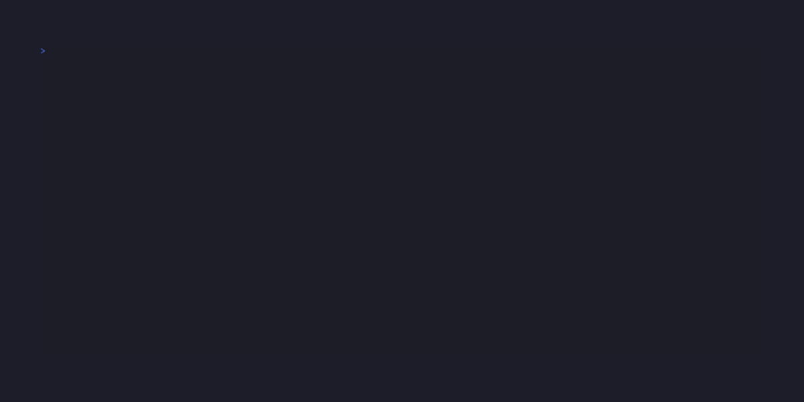

# Rikami

A CLI tool to help me manage my Kubernetes manifests.

In short it is used to automate generating Helm charts (mainly values files) with the help of preconfigured templates and functions.

Generated charts are using [rikami chart library](https://github.com/b-zago/rikami-charts) to create desired resources.

## Chart generation

Primary usage of **rika** is to generate charts meant for [rikami chart library](https://github.com/b-zago/rikami-charts) to consume.

This leverages Go's template engine as "presets" (called "shards") for commonly used sets of resources.

**Shards** are composed with **shard parts**
**Vessels** are composed with **Shards**

### Shards
For example (shard example and function explanation)
```

{{shard "WebServer"}}

{{begin "Routes"}}
{{set "name" "web-server-route"}}
{{set "runsOn" "web-server-service"}}
{{receive "host"}}

{{begin "Services"}}
{{bind "name" "Routes@runsOn"}}
{{set "runsOn" "web-server"}}
{{set "port" 80}}
{{receive "targetPort"}}

{{begin "Deployments"}}
{{bind "name" "Services@runsOn"}}
{{receive "image"}}
{{set "imagePullSecret" "ghcr-creds"}}
{{receive "runsOn"}}
{{set "component" "server"}}
{{bind "containerPort" "Services@targetPort"}}

{{seal}}
```

A quick rundown of what's going on:

- `{{shard "WebServer"}}` - we declare this is a shard from WebServer.shard file.
- `{{begin "Routes"}}` - we start defining a **shard part**.
- `{{set "name" "web-server-route"}}` - we set shard's .Routes.name to "web-server-route".
- `{{receive "host"}}` - we sign that this shard's .Routes.host field must be provided by a **vessel** (more on vessels below).
- `{{bind "name" "Routes@runsOn"}}` - basically we specify here that .Services.name will be equal to same shard's .Routes.runsOn field value. 
- `{{seal}}` - we declare that this is the end of the shard.

For more information look into **Shard functions**

For more shards examples take a look at [shards/](./shards/)

### Vessels
**Shards** are just blocks that are used to build the application for you to customize further. The collection of customized shards is called a **Vessel**

Here is a simple example of putting shards together inside a vessel:

```
{{conf "Chart"}}
---
{{cast "Chart" "Chart"}}
{{cast "WebServer" "webServer"}}
---
{{global "env" "staging"}}

{{override .Chart.Main "description" "myapp description"}}
{{request .Chart.Main "name" "Chart name"}}
{{append .Chart.Main "dependencies[0]" (map "version" "0.1.1")}}
{{$prefix := print .Chart.Main.name "-"}}

{{target .Chart.Main.name}}

{{override .webServer.Routes "host" "myapp.domain.com"}}
{{override .webServer.Services "targetPort" 8000}}
{{override .webServer.Deployments "image" "myapp:latest"}}
{{override .webServer.Deployments "runsOn" "nginx"}}

{{summon "values-staging"}}

{{global "env" "prod"}}
{{summon "values-prod"}}
```

And again a quick rundown. For more details refer to **Vessel functions**:

- `{{conf "Chart"}}` - signs which shards should be treated as configuration. (Confs are files that will be generated separately from main vessel values. Look at **Confs and Globals** section)
- `{{cast "WebServer" "webServer"}}` - we are defining that we will be using `WebServer` shard and we are giving it a defined name of "webServer".
- `{{global "env" "staging"}}` - we set a global value for "env" (Look at **Confs and Globals** section)
- `{{request .Chart.Main "name" "Chart name"}}` - we will prompt user for chart name. Here we will give it "myapp"
- `{{append .Chart.Main "dependencies[0]" (map "version" "0.1.1")}}` - we set Rikami library version using append function.
- `{{$prefix := print .Chart.Main.name "-"}}` - we can manipulate data freely and use default Go template functions without a problem.
- `{{target .Chart.Main.name}}` - specifies where to create generated chart. 
- `{{override .webServer.Routes "host" "scorevaultin.zagoapps.com"}}` - we override .webServer.Routes.host value with "myapp.domain.com"
- `{{summon "values-staging"}}` - the above values will be generated into `values-staging.yaml` 

After the first summon we only change the global `env` value and call `{{summon "values-prod"}}`. This will generate the same values file as `values-staging.yaml` but with env value changed. You can think of it as an overlay on top of what was already defined. This is useful especially for automatic secret encryption.

Vessels are separated by 3 blocks with "---". First one is strictly for `conf`. Second is strictly for `cast` (although you could also set globals there). And last one is for everything else.

After we have our vessel ready we can now `rika summon <vessel>` to generate the chart. Where vessel is the filename without ".shard" extension.

Generated chart using the above example can be found in [examples/myapp/](./examples/myapp/)

For more examples take a look at [vessels/](./vessels/). Vessels there are using shards from [shards/](./shards/)

## Vessel generation

Let's say I want to create a vessel for my python application that needs postgres to work. I'm too lazy to write the vessel by hand so I just:

`rika forge newapp`



Forge scans each shard that you call for fields to **receive** and prompts you automatically.

Here for postgres secret data we used ***input function*** `!secRand` which takes keys and will put ***vessel function*** `secRand` as value to override postgres secret data with.

We also used ***forge function*** `!appendSec` to append postgres secret to app's deployment. Since forge also creates an overlay for values-staging, this will be copied to overlay as well to encrypt secrets for another env specifically.

Forge also applies the standard `Chart.shard` as conf.

For this example it wil create `newapp.ves` file in your rikami resources directory specified during config.

Generated vessel with the example above can be found in [exmaples/forge/](./examples/forge/) as well as generated chart using that vessel.

## Confs and Globals

Configuration shards data will be generated alongside the main vessel data. Configuration shards should only have one part called `Main` and need to be signed properly in the vessel (refer to **Functions** section)

Globals are key-value pairs that will be generated outside the main vessel groups, at the top level of a file. You can access global values as `.Globals.Values.<key>`. To set global values refer to **Functions**. Global value `env` must be set.

## Functions

Target path string is constructed in the following way:
- `Services@name[]` - here we target `name` field in `Services` shard part and return the result as list.
- `Secrets@runsOnList[1]` - we can also target specific elements in a list.

### Shard functions
- `{{shard <filename:string>}}` - indicates the beginning of a shard, takes filename of a shard without extension
- `{{begin <partName:string>}}` - begins part of a shard.
- `{{set <key:string> <value:any>}}` - sets value of a key in a shard part.
- `{{receive <key:string>}}` - marks a key in a shard part as required to be provided.
- `{{envGen <name:string> <value:string>}}` - returns a list of maps that can be applied to `envVars`. You can provide many name-value pairs.
- `{{list <any>}}` - takes many values and returns a list of them.
- `{{map <key:string> <value:any>}}` - returns a map of key-value pairs. You can provide many key-value pairs.
- `{{bind <key:string> <targetPathString:string>}}` - binds the value of a key to a specific value under the target path string. 
- `{{seal}}` - signals the end of a shard.

### Vessel functions
- `{{conf <definedName:string>}}` - signs which shards should be treated as configuration. This should be a defined name of configuration shard.
- `{{cast <shardName:string> <definedName:string>}}` - signs that this shard will be used in a vessel under specified `definedName`
- `{{global <key:string> <value:string>}}` - sets a global key-value pair. 
- `{{request <key:string> <prompt:string>}}` - upon calling `summon` command, this will prompt the caller to provide a value. 
- `{{override <shardPath> <key:string> <value:any>}}` - overrides the value under the key in the `shardPath`. This can also be used to add key-value pair to shard part. See **Chart generation** for examples.
- `{{append <shardPath> <targetPathString:string> <value:list|map>}}` - appends list to list or map to map. In case of maps, if the same key occurs it gets overwritten. Can use target path string to access specific values to append to. 
- `{{target <filepath:string>}}` - specifies where to create generated chart.
- `{{envMake <path:string>}}` - takes path to .env file relative to where the `summon` is run from and returns the list of maps for `envVars`. 
- `{{secMake <path:string>}}` - takes path to .env file relative to where the `summon` is run from and returns a map of key-value pairs where values already have been sealed by kubeseal. 
- `{{secRand <secretName:string> <key:string>}}` - returns map of key-value pairs with values randomly generated and sealed with kubeseal. Unsealed values are saved into `.env.<secretName>.secret` in the location from where `summon` was called. You can specify many keys.
- `{{summon <filename:string>}}` - ends the current vessel configuration and writes to a specified filename.
- `{{envGen <name:string> <value:string>}}` - returns a list of maps that can be applied to `envVars`. You can provide many name-value pairs.
- `{{list <any>}}` - takes many values and returns a list of them.
- `{{map <key:string> <value:any>}}` - returns a map of key-value pairs. You can provide many key-value pairs.

### Forge functions and commands

Functions have `!` prefix

- `!ls` - lists available shards.
- `!dryrun` - displays how currently forged vessel would look like
- `!override <shardPath> <key:string> <value:any>` - works same as regular override. You don't wrap `key` in quotes.
- `!append <shardPath> <targetPathString:string> <value:list|map>` - works same as regular append. You don't wrap `targetPathString` in quotes.
- `!appendSec <definedName:string> <shardPath>` - it tries to detect `Secrets` part in a shard and it appends `envSecretRef` to specified `shardPath` as well as updating `runsOnList` of the secret. Note that you need to add "." before paths. 
- `!overrideEnvGen <shardPath>` - easy way to override `envVars` with `envGen`. Will prompt for name-value pairs. 
- `shard <filename:string>` - add shard to the currently forged vessel.
- `done` - finish forging and save.
- `exit` - does exactly that. Nothing gets saved.

### Forge input functions
- `!secMake` - returns `secMake` function with .env.secret as filepath 
- `!envMake` - returns `envMake` function with .env as filepath 
- `!secRand` - returns `secRand` function and will prompt for keys.

## Important notes
- configuration shards should have only one part `Main`
- order matters as templates are executed line-by-line.
- avoid mixing same types of shards (that have the same name labels for example) in the same vessel
- if you define 2 charts from the same file the bindLabels (defined in config file) will get the incrementing suffix (like "*-1" "*-2" and so on)
- you can only append/override basing off of specified shard parts.
- shard file names and defined names can't contain '-' as it break Go's templating. Use camelCase instead.
- after the first `{{summon}}` binds are generally disabled. Meaning sources that were bound until the first `{{summon}}` will stay in that state, but they will not bind automatically after that if you change the bind target. Use overlays for small and precise changes, not relying on binding behaviour.
